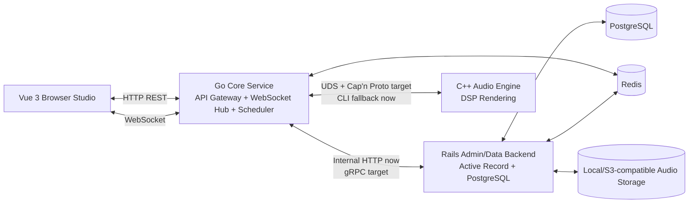

# Quokka-Lab

Quokka-Lab is a web-based music creation and sharing platform built around an efficiency-first heterogeneous architecture. Vue powers the browser studio, Go is the public core service, Rails owns data and administration, and C++ handles offline audio DSP.

The goal is to keep every language in the place where it is strongest:

- Vue 3 and TypeScript provide the creative interface, keyboard input, recording, and visualization.
- Go exposes the public REST API boundary, WebSocket collaboration rooms, gateway logic, and future task scheduling.
- Rails remains the internal data authority for Active Record models, migrations, uploads, and admin-oriented workflows.
- C++ performs CPU-heavy audio rendering, including reverb, delay, and pitch shifting.
- PostgreSQL stores durable application data, and Redis is reserved for cache, sessions, rate limiting, and Redis Stream jobs.

## Architecture



## Repository Layout

```text
quokka-lab/
├── frontend/                 Vue 3 + TypeScript studio
├── backend/
│   ├── go/                   Go API gateway, WebSocket hub, service orchestration
│   ├── rails/                Rails API-mode data authority and upload backend
│   ├── cpp/                  C++20 audio DSP command-line engine
│   └── proto/                Internal gRPC and Cap'n Proto contracts
├── infra/nginx/              Local reverse proxy configuration
├── docs/                     Architecture and learning/build path
├── deploy/                   Reserved deployment manifests
└── docker-compose.yml
```

## Current MVP

- Two-octave browser keyboard from C4 to B5.
- Mouse and computer-keyboard note input.
- Web Audio synthesis with sine, square, sawtooth, and triangle oscillators.
- AudioWorklet-aware output path with a direct Web Audio fallback.
- MediaRecorder recording, preview, download, and upload.
- Public composition list backed by Rails and PostgreSQL.
- Go gateway health, AI placeholder endpoints, and Liora trigger endpoint.
- Go WebSocket collaboration room at `/ws/collaboration/:room_id`.
- C++ command-line audio engine with reverb, delay, and basic pitch shifting.
- Docker Compose local stack with Nginx, Vue, Go, Rails, PostgreSQL, Redis, Sidekiq, and C++ build service.

## Requirements

The recommended path is Docker Desktop with the Linux/WSL2 engine enabled.

For manual development, install:

- Node.js 22+
- Go 1.22+
- Ruby 3.3+
- PostgreSQL 17+
- Redis 7+
- CMake 3.20+
- A C++20 compiler
- libsndfile
- ffmpeg

## Quick Start

From the repository root:

```bash
docker compose up --build
```

Open:

```text
http://localhost:8088
```

Useful local URLs:

```text
Unified app entry:   http://localhost:8088
Frontend dev server: http://localhost:5173
Go gateway:          http://localhost:8080
Rails internal API:  http://localhost:3000
PostgreSQL:          localhost:5432
Redis:               localhost:6379
```

The first startup can take a while because Docker installs dependencies, builds the C++ engine, prepares Rails dependencies, and starts the Go gateway.

## Main API Surface

Public traffic should enter through the Go gateway:

```http
GET    /api/v1/health
GET    /api/v1/compositions
POST   /api/v1/compositions
GET    /api/v1/compositions/:id
PATCH  /api/v1/compositions/:id
DELETE /api/v1/compositions/:id
GET    /api/v1/compositions/:composition_id/comments
POST   /api/v1/compositions/:composition_id/comments
POST   /api/v1/compositions/:composition_id/like
DELETE /api/v1/compositions/:composition_id/like
POST   /api/v1/audio/process
POST   /api/v1/signup
POST   /api/v1/login
DELETE /api/v1/logout
POST   /api/v1/ai/chords
POST   /api/v1/ai/mix
POST   /api/v1/ai/style_transfer
POST   /internal/liora_trigger
WS     /ws/collaboration/:room_id
```

During the MVP, Go handles gateway-owned endpoints directly and proxies persistence-heavy resources to Rails. The planned next step is to replace internal proxy calls with gRPC contracts from `backend/proto/rails_service.proto`.

Health check:

```bash
curl http://localhost:8088/api/v1/health
```

Upload a composition:

```bash
curl -F "composition[title]=First melody" \
  -F "composition[bpm]=120" \
  -F "composition[key_signature]=C" \
  -F "composition[midi_data]={\"events\":[]}" \
  -F "composition[audio]=@recording.webm" \
  http://localhost:8088/api/v1/compositions
```

Process audio through the C++ fallback path:

```bash
curl -F "title=Processed melody" \
  -F "reverb=0.65" \
  -F "delay_ms=250" \
  -F "pitch_semitones=0" \
  -F "audio=@recording.webm" \
  http://localhost:8088/api/v1/audio/process
```

## Keyboard Mapping

White keys:

```text
A S D F G H J K L Z X C V B
```

Black keys:

```text
Q W E R T Y U I O P
```

## Manual Development

Frontend:

```bash
cd frontend
npm install
npm run dev
```

Go gateway:

```bash
cd backend/go
go mod tidy
go run ./cmd/api
go test ./...
```

Rails data backend:

```bash
cd backend/rails
bundle install
bin/rails db:prepare
bin/rails db:seed
bin/rails server
```

Sidekiq:

```bash
cd backend/rails
bundle exec sidekiq
```

C++ audio engine:

```bash
cd backend/cpp
cmake -S . -B build
cmake --build build
./build/quokka_audio input.wav output.wav --reverb 0.8 --delay-ms 250 --pitch-semitones 0
```

## Docker Commands

Start all services:

```bash
docker compose up --build
```

Start in the background:

```bash
docker compose up -d --build
```

View service status:

```bash
docker compose ps
```

View logs:

```bash
docker compose logs -f go rails frontend nginx
```

Stop services:

```bash
docker compose down
```

Reset local database volumes:

```bash
docker compose down -v
docker compose up --build
```

## Documentation

- `docs/architecture.md` explains the Go/Rails/C++ responsibility split and major request flows.
- `docs/learning-path.md` lists a simple-to-advanced learning and build order based on official language and framework documentation.
- `backend/proto/rails_service.proto` reserves the internal Rails gRPC boundary.
- `backend/proto/audio.capnp` reserves the Go-to-C++ Unix domain socket message contract.

## Notes

- Rails is still reachable on port `3000` for local debugging, but browser and client traffic should use the Go gateway.
- The C++ pitch-shift effect is an MVP implementation based on linear resampling. Replace it with a phase vocoder for production-quality pitch shifting.
- The AI endpoints currently return deterministic scaffold responses and are ready for future model integration.
- The Liora integration endpoint is reserved for future sound-module triggers through `POST /internal/liora_trigger`.
