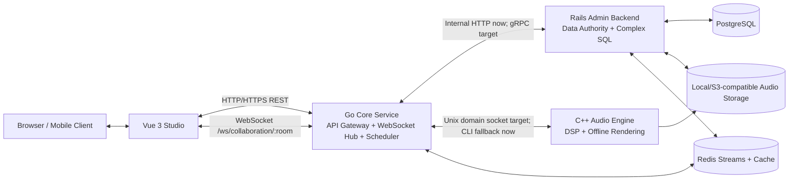

# Quokka-Lab Architecture

Quokka-Lab uses a purpose-driven heterogeneous architecture. Vue owns the creative interface, Go owns public network traffic and realtime coordination, Rails owns relational data and administration, and C++ owns CPU-heavy audio processing.

## Logical View

## Responsibility Boundaries

| Component | Stack | Primary responsibility | Communication |
| --- | --- | --- | --- |
| Web studio | Vue 3, TypeScript, Vite, Web Audio API | Browser synthesis, recording, visual editing, composition upload | Public HTTP and WebSocket to Go |
| Core service | Go standard library, gorilla/websocket, future grpc-go | API gateway, auth boundary, rate limiting, realtime rooms, task dispatch | Public HTTP/WS, internal Rails calls, C++ UDS boundary |
| Admin/data backend | Rails 8 API mode, Active Record, PostgreSQL | Data authority, migrations, admin workflows, uploads, complex queries | Internal-only service behind Go |
| Audio engine | C++20, CMake, libsndfile | Reverb, delay, pitch shifting, future SIMD/multithreaded rendering | UDS + Cap'n Proto target; command-line fallback |
| Runtime data | PostgreSQL, Redis | Durable records, cache, session data, lightweight job stream | Accessed by Go and Rails according to ownership |
| Edge proxy | Nginx | Unified local URL and static proxying | Routes `/api`, `/ws`, `/rails/active_storage`, and frontend traffic |

## Request Flow: Upload A Recording

1. Vue records audio in the browser with `MediaRecorder`.
2. Vue sends `multipart/form-data` to `POST /api/v1/compositions`.
3. Go receives the public request, applies the gateway boundary, and proxies persistence work to Rails.
4. Rails stores metadata in PostgreSQL and stores the audio through Active Storage.
5. Rails returns JSON to Go; Go returns the same public response to Vue.

## Request Flow: Realtime Collaboration

1. Vue opens `ws://localhost:8088/ws/collaboration/default-room`.
2. Go upgrades the connection with gorilla/websocket.
3. Every note-on and note-off event is broadcast to other clients in the same room.
4. Rails can later persist collaboration snapshots through internal APIs.

## Request Flow: Offline Audio Processing

1. Vue sends `POST /api/v1/audio/process`.
2. Go owns the public request and currently forwards the upload to Rails for MVP compatibility.
3. Rails invokes the C++ command-line engine as a fallback path.
4. The planned production path is Go to C++ over Unix domain sockets using `backend/proto/audio.capnp`.

## Evolution Plan

| Phase | Goal | Result |
| --- | --- | --- |
| 1 | Go gateway handles health, AI placeholders, WebSocket, and Rails proxying | Public traffic has one stable entry point |
| 2 | Replace Rails proxy calls with gRPC contracts from `backend/proto/rails_service.proto` | Typed internal service boundary |
| 3 | Convert C++ CLI to a resident UDS worker using `audio.capnp` | Lower latency and fewer process startups |
| 4 | Move task dispatch to Redis Streams and add worker scaling | Reliable long-running audio/AI jobs |
| 5 | Add production auth, rate limits, and observability | Safer public deployment |
